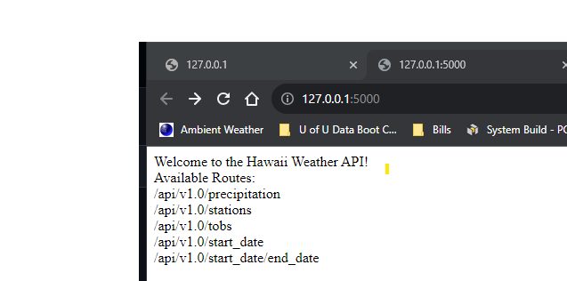

# SurfsUp

## Description
Climate analysis and flask API project

## Table of Contents
- [Installation](#installation)
- [Usage](#usage)
- [Credits](#credits)
- [License](#license)
- [Features](#features)
- [Tests](#tests)
- [Contact](#contact)

## Installation
flask, pandas, slqalchemy, matplotlib

## Usage
place path on URL to get result

## Credits
Richard Thomas

## Features
Climate JSON data

## Tests
None

## Contact
If there are any questions of concerns, I can be reached at:
##### [github: rthomasut](https://github.com/rthomasut)
##### [email: rthomasut@gmail.com](mailto:rthomasut@gmail.com)
